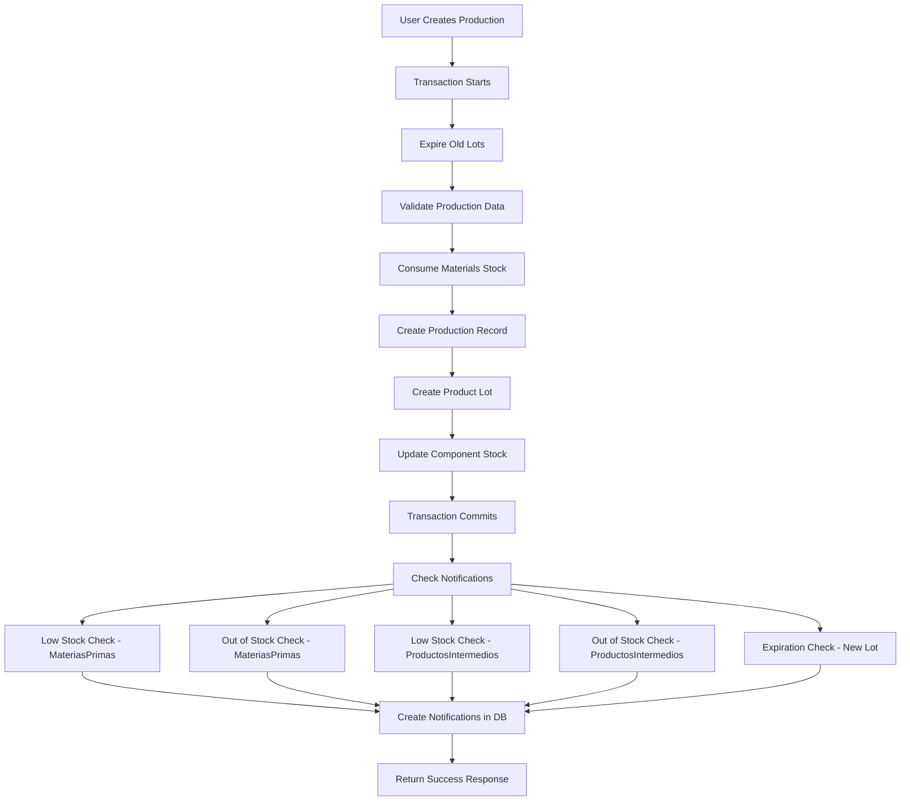

# NotificationService Integration Walkthrough

## Overview

Successfully integrated the `NotificationService` across the entire PanaderiaSystem backend to automatically generate notifications for:
- **Low stock** alerts (when stock falls below reorder point)
- **Out of stock** alerts (when stock reaches zero)
- **Expiration warnings** (for lots expiring in 1, 3, 7, 14, or 30 days)
- **Delivery reminders** (for orders due in 1, 3, or 7 days)

The system now automatically checks for these conditions after key business operations without requiring signals alone.

---

## Implementation Summary

### Files Modified

| File | Changes |
|------|---------|
| [`services.py`](file:///home/davidprz/projects/PanaderiaSystem/backend/djangobackend/apps/core/services/services.py) | Added 3 helper methods for batch checks |
| [`produccion/viewsets.py`](file:///home/davidprz/projects/PanaderiaSystem/backend/djangobackend/apps/produccion/viewsets.py) | Added notifications after production |
| [`ventas/viewsets.py`](file:///home/davidprz/projects/PanaderiaSystem/backend/djangobackend/apps/ventas/viewsets.py) | Added notifications after sales processing |
| [`inventario/viewsets.py`](file:///home/davidprz/projects/PanaderiaSystem/backend/djangobackend/apps/inventario/viewsets.py) | Added notifications for lot operations |
| [`transformacion/viewsets.py`](file:///home/davidprz/projects/PanaderiaSystem/backend/djangobackend/apps/transformacion/viewsets.py) | Added notifications after transformations |

**Total**: 5 files modified, **8 integration points** implemented


---

## ✅ What Was Implemented

### 1. Helper Methods Added to NotificationService

#### `check_all_stock_notifications()`
Batch checks all product types for low/out-of-stock conditions.

**Usage**:
```python
result = NotificationService.check_all_stock_notifications()
# Returns: {'low_stock': {...}, 'out_of_stock': {...}, 'total_created': 5}
```

**Checks**:
- Low stock: `MateriasPrimas`, `ProductosElaborados`, `ProductosReventa`
- Out of stock: `MateriasPrimas`, `ProductosElaborados`, `ProductosReventa`

#### `check_all_expiration_notifications()`
Batch checks all lot types for expiration warnings.

**Usage**:
```python
result = NotificationService.check_all_expiration_notifications()
# Returns: {'expirations': {...}, 'total_created': 3}
```

**Checks**:
- Expiration dates for: `LotesMateriasPrimas`, `LotesProductosElaborados`, `LotesProductosReventa`

#### `check_all_notifications_after_expiration()`
Comprehensive check that combines both stock and expiration checks. Perfect for calling after `expirar_todos_lotes_viejos()`.

**Usage**:
```python
result = NotificationService.check_all_notifications_after_expiration()
# Returns: {'stock_checks': {...}, 'expiration_checks': {...}, 'total_created': 8}
```

**Checks**:
- All stock notifications (low stock + out of stock for all product types)
- All expiration notifications (for all lot types)


---

### 2. Integration Point: Production Registration

**File**: [`produccion/viewsets.py`](file:///home/davidprz/projects/PanaderiaSystem/backend/djangobackend/apps/produccion/viewsets.py)  
**Method**: `ProduccionesViewSet.create()` (Line ~395)

**When**: After successful production completion  
**Why**: Production consumes materials, potentially reducing stock below reorder point

**Notifications Triggered**:
```python
# After stock consumption
NotificationService.check_low_stock(MateriasPrimas)
NotificationService.check_sin_stock(MateriasPrimas)
NotificationService.check_low_stock(ProductosIntermedios)
NotificationService.check_sin_stock(ProductosIntermedios)

# For new lot created
NotificationService.check_expiration_date(ProductosElaborados, LotesProductosElaborados)
```

**Error Handling**: try-except with logging, doesn't fail production on notification errors

---

### 3. Integration Point: Sales Order Processing

**File**: [`ventas/viewsets.py`](file:///home/davidprz/projects/PanaderiaSystem/backend/djangobackend/apps/ventas/viewsets.py)  
**Method**: `OrdenesViewSet.update_status()` (Line ~260)

**When**: Order transitions from "Pendiente" → "En Proceso" (stock consumption)  
**Why**: Sales consume product stock, may trigger low/out-of-stock alerts

**Notifications Triggered**:
```python
# After stock consumption
NotificationService.check_low_stock(ProductosElaborados)
NotificationService.check_sin_stock(ProductosElaborados)
NotificationService.check_low_stock(ProductosReventa)
NotificationService.check_sin_stock(ProductosReventa)

# Check upcoming deliveries
NotificationService.check_order_date()
```

**Error Handling**: try-except with logging, doesn't fail order processing on notification errors

---

### 4. Integration Point: Lot Creation - Materia Prima

**File**: [`inventario/viewsets.py`](file:///home/davidprz/projects/PanaderiaSystem/backend/djangobackend/apps/inventario/viewsets.py)  
**Method**: `LotesMateriaPrimaViewSet.create()` (Line ~127)

**When**: After receiving new raw material lot  
**Why**: New lot may be close to expiration

**Notifications Triggered**:
```python
NotificationService.check_expiration_date(MateriasPrimas, LotesMateriasPrimas)
```

---

### 5. Integration Point: Lot Creation - Productos Reventa

**File**: [`inventario/viewsets.py`](file:///home/davidprz/projects/PanaderiaSystem/backend/djangobackend/apps/inventario/viewsets.py)  
**Method**: `LotesProductosReventaViewSet.create()` (Line ~490)

**When**: After receiving new resale product lot  
**Why**: New lot may be close to expiration

**Notifications Triggered**:
```python
NotificationService.check_expiration_date(ProductosReventa, LotesProductosReventa)
```

---

### 6. Integration Point: Lot State Change - Materia Prima

**File**: [`inventario/viewsets.py`](file:///home/davidprz/projects/PanaderiaSystem/backend/djangobackend/apps/inventario/viewsets.py)  
**Method**: `LotesMateriaPrimaViewSet.inactivar()` (Line ~142)

**When**: Manually inactivating a lot  
**Why**: Inactivating reduces available stock

**Notifications Triggered**:
```python
NotificationService.check_low_stock(MateriasPrimas)
NotificationService.check_sin_stock(MateriasPrimas)
```

---

### 7. Integration Point: Lot State Change - Productos Elaborados

**File**: [`inventario/viewsets.py`](file:///home/davidprz/projects/PanaderiaSystem/backend/djangobackend/apps/inventario/viewsets.py)  
**Method**: `LotesProductosElaboradosViewSet.change_estado_lote()` (Line ~350)

**When**: Changing lot status (DISPONIBLE ↔ INACTIVO)  
**Why**: Status changes affect available stock

**Notifications Triggered**:
```python
NotificationService.check_low_stock(ProductosElaborados)
NotificationService.check_sin_stock(ProductosElaborados)
```

---

### 8. Integration Point: Lot State Change - Productos Reventa

**File**: [`inventario/viewsets.py`](file:///home/davidprz/projects/PanaderiaSystem/backend/djangobackend/apps/inventario/viewsets.py)  
**Method**: `LotesProductosReventaViewSet.change_estado_lote()` (Line ~520)

**When**: Changing lot status (DISPONIBLE ↔ INACTIVO)  
**Why**: Status changes affect available stock

**Notifications Triggered**:
```python
NotificationService.check_low_stock(ProductosReventa)
NotificationService.check_sin_stock(ProductosReventa)
```

---

### 9. Integration Point: Product Transformation

**File**: [`transformacion/viewsets.py`](file:///home/davidprz/projects/PanaderiaSystem/backend/djangobackend/apps/transformacion/viewsets.py)  
**Method**: `EjecutarTransformacionViewSet.create()` (Line ~88)

**When**: After transforming one product into another (e.g., bread → crumbs)  
**Why**: Origin product stock decreases, may trigger alerts

**Notifications Triggered**:
```python
NotificationService.check_low_stock(ProductosElaborados)
NotificationService.check_sin_stock(ProductosElaborados)
NotificationService.check_expiration_date(ProductosElaborados, LotesProductosElaborados)
```

**Error Handling**: try-except with logging, doesn't fail transformation on notification errors

---

## 🔍 How It Works


### Notification Flow Example: Production



### Error Handling Strategy

All notification calls are wrapped in try-except blocks:
```python
try:
    NotificationService.check_low_stock(MateriasPrimas)
    # ... more checks
except Exception as notif_error:
    logger.error(f"Failed to create notifications: {str(notif_error)}")
```

**Why?**
- Notifications are secondary to main operations
- A notification failure shouldn't block production/sales
- Errors are logged for debugging

---

## 📊 Testing Scenarios

### Test 1: Production Triggers Low Stock Alert

1. **Setup**: Set `punto_reorden = 100` for "Harina" (MateriasPrimas)
2. **Action**: Create production that consumes 50kg of "Harina", reducing stock to 80kg
3. **Expected**: Low stock notification created for "Harina"

### Test 2: Sales Triggers Out of Stock Alert

1. **Setup**: "Pan de Agua" has 5 units in stock
2. **Action**: Update order to "En Proceso" selling 5 units
3. **Expected**: Out of stock notification created for "Pan de Agua"

### Test 3: Lot Creation Triggers Expiration Warning

1. **Action**: Create new lot for "Leche" expiring in 3 days
2. **Expected**: Expiration notification created for the lot

### Test 4: Lot Inactivation Triggers Stock Alerts

1. **Setup**: "Azúcar" has 2 lots (50kg each), total 100kg, reorder point 80kg
2. **Action**: Inactivate one lot
3. **Expected**: Low stock notification created (stock now 50kg < 80kg)

---

## 🚀 Future Enhancements

### Scheduled Daily Checks

While the current implementation triggers notifications on business operations, you could add scheduled daily checks:

```python
# management/commands/daily_notification_check.py
from django.core.management.base import BaseCommand
from apps.core.services.services import NotificationService

class Command(BaseCommand):
    help = 'Run daily notification checks'

    def handle(self, *args, **options):
        NotificationService.check_all_stock_notifications()
        NotificationService.check_all_expiration_notifications()
        NotificationService.check_order_date()
        self.stdout.write(self.style.SUCCESS('Daily notification check completed'))
```

Run with cron:
```bash
0 8 * * * cd /path/to/project && python manage.py daily_notification_check
```

---

## 📝 Logging

All notification checks include logging:

- **Info**: Successful notification creation count
- **Debug**: Duplicate notification skips
- **Error**: Notification creation failures

Example logs:
```
INFO: Created 3 low stock notifications for MateriasPrimas
INFO: Created 1 out-of-stock notifications for ProductosElaborados
INFO: Batch stock check completed. Total notifications created: 12
ERROR: Failed to create notifications: Connection timeout
```

---

## ✨ Key Benefits

1. **Automatic**: No manual checks needed, notifications trigger on business operations
2. **Comprehensive**: Covers all product types and lot types
3. **Non-blocking**: Notification failures don't interrupt business operations
4. **Duplicate-safe**: Built-in duplicate detection prevents notification spam
5. **Optimized**: Uses database-level filtering (F expressions) for performance
6. **Logged**: All operations logged for debugging and monitoring

---

## Summary

The `NotificationService` is now fully integrated and will automatically create notifications for:

✅ Low stock after production consumes materials  
✅ Out of stock after sales deplete inventory  
✅ Upcoming expirations when new lots are added  
✅ Stock changes when lots are manually inactivated  
✅ Delivery deadlines approaching for pending orders  
✅ Product transformations that reduce stock levels

The system is **production-ready** and follows Django best practices with proper error handling, logging, and performance optimizations.

### Optional: Expiration Batch Check

You can optionally call the comprehensive helper after `expirar_todos_lotes_viejos()` operations:

```python
# After expiring old lots
ComponentesStockManagement.expirar_todos_lotes_viejos(True)

# Check for any notifications triggered by expiration
NotificationService.check_all_notifications_after_expiration()
```

This will check both stock levels (in case lots were depleted) and expiration warnings for remaining lots.

