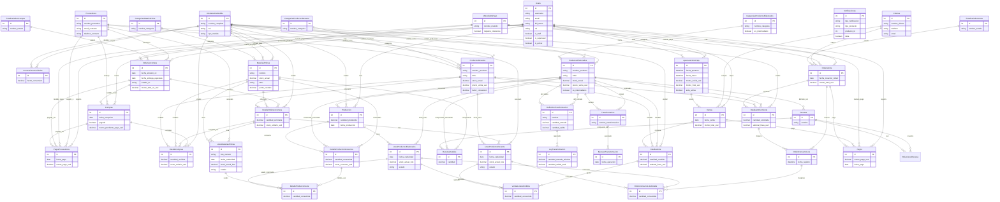

# Database Schema Diagram

Copy the code block below and paste it into the [Mermaid Live Editor](https://mermaid.live/) to visualize the database structure.

```mermaid
erDiagram
    %% --- USERS APP ---
    Users {
        int id PK
        string username
        string email
        string full_name
        string rol
        boolean is_staff
        boolean is_superuser
        boolean is_active
    }

    %% --- CORE APP ---
    UnidadesDeMedida {
        int id PK
        string nombre_completo
        string mk
        string tipo_medida
    }

    ConversionesUnidades {
        int id PK
        decimal factor_conversion
    }

    CategoriasMateriaPrima {
        int id PK
        string nombre_categoria
    }

    CategoriasProductosElaborados {
        int id PK
        string nombre_categoria
        boolean es_intermediario
    }

    CategoriasProductosReventa {
        int id PK
        string nombre_categoria
    }

    MetodosDePago {
        int id PK
        string nombre_metodo
        boolean requiere_referencia
    }

    EstadosOrdenVenta {
        int id PK
        string nombre_estado
    }

    EstadosOrdenCompra {
        int id PK
        string nombre_estado
    }

    Notificaciones {
        int id PK
        string tipo_notificacion
        string tipo_producto
        int producto_id
        boolean leida
    }

    %% --- COMPRAS APP ---
    Proveedores {
        int id PK
        string nombre_proveedor
        string email_contacto
        string telefono_contacto
    }

    OrdenesCompra {
        int id PK
        date fecha_emision_oc
        date fecha_entrega_esperada
        string estado_oc
        decimal monto_total_oc_usd
    }

    Compras {
        int id PK
        date fecha_recepcion
        boolean pagado
        decimal monto_pendiente_pago_usd
    }

    PagosProveedores {
        int id PK
        date fecha_pago
        decimal monto_pago_usd
    }

    DetalleOrdenesCompra {
        int id PK
        decimal cantidad_solicitada
        decimal costo_unitario_usd
    }

    DetalleCompras {
        int id PK
        decimal cantidad_recibida
        decimal costo_unitario_usd
    }

    %% --- INVENTARIO APP ---
    MateriasPrimas {
        int id PK
        string nombre
        decimal stock_actual
        string SKU
        decimal punto_reorden
    }

    ProductosElaborados {
        int id PK
        string nombre_producto
        string SKU
        decimal stock_actual
        decimal precio_venta_usd
        boolean es_intermediario
    }

    ProductosReventa {
        int id PK
        string nombre_producto
        string SKU
        decimal stock_actual
        decimal precio_venta_usd
        decimal factor_conversion
    }

    LotesMateriasPrimas {
        int id PK
        string lote_numero
        date fecha_caducidad
        decimal stock_actual_lote
        string estado
    }

    LotesProductosReventa {
        int id PK
        date fecha_caducidad
        decimal stock_actual_lote
        string estado
    }

    LotesProductosElaborados {
        int id PK
        date fecha_caducidad
        decimal stock_actual_lote
        string estado
    }

    %% --- PRODUCCION APP ---
    Produccion {
        int id PK
        decimal cantidad_producida
        date fecha_produccion
    }

    Recetas {
        int id PK
        string nombre
    }

    RecetasDetalles {
        int id PK
        decimal cantidad
    }

    DetalleProduccionCosumos {
        int id PK
        decimal cantidad_consumida
        decimal costo_consumo_usd
    }

    DetalleProduccionLote {
        int id PK
        decimal cantidad_consumida
    }

    %% --- TRANSFORMACION APP ---
    DefinicionTransformacion {
        int id PK
        string nombre
        decimal cantidad_entrada
        decimal cantidad_salida
    }

    LogTransformacion {
        int id PK
        decimal cantidad_entrada_efectiva
        decimal cantidad_salida_total
    }

    Transformacion {
        int id PK
        string nombre_transformacion
    }

    EjecutarTransformacion {
        int id PK
        date fecha_ejecucion
    }

    %% --- VENTAS APP ---
    Clientes {
        int id PK
        string nombre_cliente
        string telefono
        string email
    }

    AperturaCierreCaja {
        int id PK
        datetime fecha_apertura
        datetime fecha_cierre
        decimal monto_inicial_usd
        decimal monto_final_usd
        boolean esta_activa
    }

    Ventas {
        int id PK
        date fecha_venta
        decimal monto_total_usd
    }

    DetalleVenta {
        int id PK
        decimal cantidad_vendida
        decimal subtotal_linea_usd
    }

    VentasLotesVendidos {
        int id PK
        decimal cantidad_consumida
    }

    OrdenVenta {
        int id PK
        date fecha_creacion_orden
        decimal monto_total_usd
    }

    DetallesOrdenVenta {
        int id PK
        decimal cantidad_solicitada
        decimal subtotal_linea_usd
    }

    OrdenConsumoLote {
        int id PK
        datetime fecha_registro
    }

    OrdenConsumoLoteDetalle {
        int id PK
        decimal cantidad_consumida
    }

    Pagos {
        int id PK
        decimal monto_pago_usd
        date fecha_pago
    }

    %% RELATIONSHIPS ---

    %% Users
    Users ||--o{ OrdenesCompra : crea
    Users ||--o{ Compras : recibe
    Users ||--o{ PagosProveedores : registra
    Users ||--o{ Produccion : crea
    Users ||--o{ AperturaCierreCaja : abre
    Users ||--o{ AperturaCierreCaja : cierra
    Users ||--o{ Ventas : cajero
    Users ||--o{ OrdenVenta : crea
    Users ||--o{ Pagos : registra

    %% Core
    UnidadesDeMedida ||--o{ ConversionesUnidades : origen
    UnidadesDeMedida ||--o{ ConversionesUnidades : destino
    UnidadesDeMedida ||--o{ MateriasPrimas : unidad_base
    UnidadesDeMedida ||--o{ MateriasPrimas : unidad_empaque
    UnidadesDeMedida ||--o{ ProductosElaborados : unidad_produccion
    UnidadesDeMedida ||--o{ ProductosElaborados : unidad_venta
    UnidadesDeMedida ||--o{ ProductosReventa : unidad_inventario
    UnidadesDeMedida ||--o{ ProductosReventa : unidad_venta
    UnidadesDeMedida ||--o{ DetalleOrdenesCompra : unidad
    UnidadesDeMedida ||--o{ DetalleCompras : unidad
    UnidadesDeMedida ||--o{ Produccion : unidad
    UnidadesDeMedida ||--o{ DetalleVenta : unidad
    UnidadesDeMedida ||--o{ DetallesOrdenVenta : unidad

    CategoriasMateriaPrima ||--o{ MateriasPrimas : categoria
    CategoriasProductosElaborados ||--o{ ProductosElaborados : categoria
    CategoriasProductosReventa ||--o{ ProductosReventa : categoria

    %% Compras
    Proveedores ||--o{ OrdenesCompra : suministra
    Proveedores ||--o{ Compras : entrega
    Proveedores ||--o{ PagosProveedores : pagado_a
    Proveedores ||--o{ ProductosReventa : proveedor_preferido
    Proveedores ||--o{ LotesMateriasPrimas : asociado
    Proveedores ||--o{ LotesProductosReventa : asociado

    EstadosOrdenCompra ||--o{ OrdenesCompra : estado
    MetodosDePago ||--o{ OrdenesCompra : metodo_pago
    MetodosDePago ||--o{ PagosProveedores : metodo_pago
    MetodosDePago ||--o{ OrdenVenta : metodo_pago
    MetodosDePago ||--o{ Pagos : metodo_pago

    OrdenesCompra ||--o{ DetalleOrdenesCompra : contiene
    OrdenesCompra ||--o{ Compras : recibido_como
    OrdenesCompra ||--o{ PagosProveedores : pagado_via

    Compras ||--o{ DetalleCompras : contiene
    Compras ||--o{ PagosProveedores : pagado_via

    DetalleOrdenesCompra ||--o{ DetalleCompras : cumplido_por
    DetalleOrdenesCompra ||--o{ LotesMateriasPrimas : crea
    DetalleOrdenesCompra ||--o{ LotesProductosReventa : crea
    
    %% Inventario & Products
    MateriasPrimas ||--o{ LotesMateriasPrimas : tiene
    MateriasPrimas ||--o{ DetalleOrdenesCompra : ordenado
    MateriasPrimas ||--o{ DetalleCompras : recibido
    MateriasPrimas ||--o{ RecetasDetalles : componente
    MateriasPrimas ||--o{ DetalleProduccionCosumos : consumido

    ProductosElaborados ||--o{ LotesProductosElaborados : tiene_lotes
    ProductosElaborados ||--o{ Recetas : definido_por
    ProductosElaborados ||--o{ RecetasDetalles : componente_intermedio
    ProductosElaborados ||--o{ Produccion : producido
    ProductosElaborados ||--o{ DetalleProduccionCosumos : consumido_intermedio
    ProductosElaborados ||--o{ DefinicionTransformacion : def_entrada
    ProductosElaborados ||--o{ DefinicionTransformacion : def_salida
    ProductosElaborados ||--o{ Transformacion : origen
    ProductosElaborados ||--o{ Transformacion : destino
    ProductosElaborados ||--o{ DetalleVenta : vendido
    ProductosElaborados ||--o{ DetallesOrdenVenta : ordenado

    ProductosReventa ||--o{ LotesProductosReventa : tiene_lotes
    ProductosReventa ||--o{ DetalleOrdenesCompra : ordenado
    ProductosReventa ||--o{ DetalleCompras : recibido
    ProductosReventa ||--o{ DetalleVenta : vendido
    ProductosReventa ||--o{ DetallesOrdenVenta : ordenado

    %% Produccion
    Produccion ||--o{ LotesProductosElaborados : crea
    Produccion ||--o{ DetalleProduccionCosumos : consume

    Recetas ||--o{ RecetasDetalles : compuesto_de
    Recetas ||--o{ RelacionesRecetas : maestra
    Recetas ||--o{ RelacionesRecetas : sub

    DetalleProduccionCosumos ||--o{ DetalleProduccionLote : detalla_uso
    LotesMateriasPrimas ||--o{ DetalleProduccionLote : usado
    LotesProductosElaborados ||--o{ DetalleProduccionLote : usado_intermedio

    %% Transformacion
    DefinicionTransformacion ||--o{ LogTransformacion : registrado
    Transformacion ||--o{ EjecutarTransformacion : ejecutado

    %% Ventas
    Clientes ||--o{ Ventas : compra
    Clientes ||--o{ OrdenVenta : ordena
    
    AperturaCierreCaja ||--o{ Ventas : sesion

    Ventas ||--o{ DetalleVenta : contiene
    Ventas ||--o{ Pagos : pago

    DetalleVenta ||--o{ VentasLotesVendidos : agota
    LotesProductosElaborados ||--o{ VentasLotesVendidos : agotado
    LotesProductosReventa ||--o{ VentasLotesVendidos : agotado

    EstadosOrdenVenta ||--o{ OrdenVenta : estado
    OrdenVenta ||--o{ DetallesOrdenVenta : contiene
    OrdenVenta ||--o{ OrdenConsumoLote : reserva
    OrdenVenta ||--o{ Pagos : pago

    OrdenConsumoLote ||--o{ OrdenConsumoLoteDetalle : desglose
    DetallesOrdenVenta ||--o{ OrdenConsumoLote : dispara
    LotesProductosElaborados ||--o{ OrdenConsumoLoteDetalle : reservado
    LotesProductosReventa ||--o{ OrdenConsumoLoteDetalle : reservado

```
